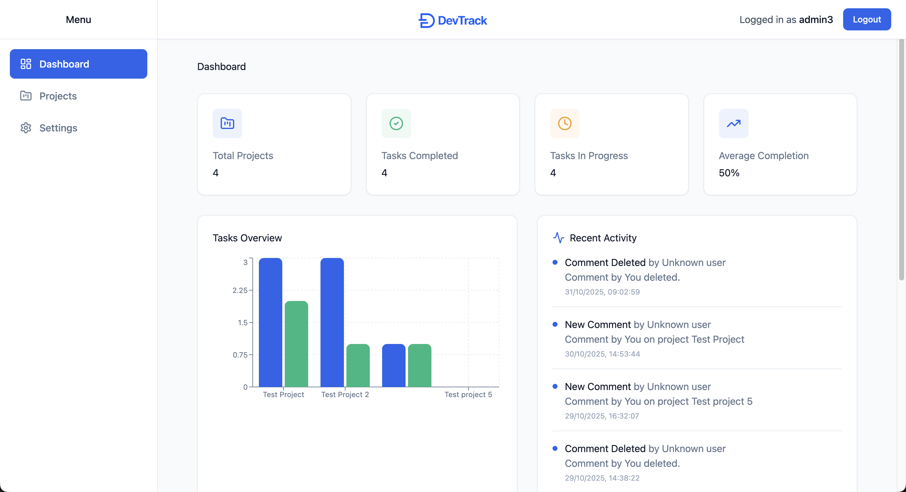
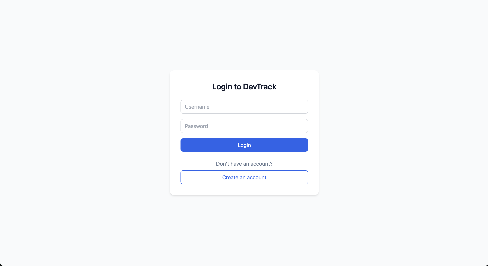
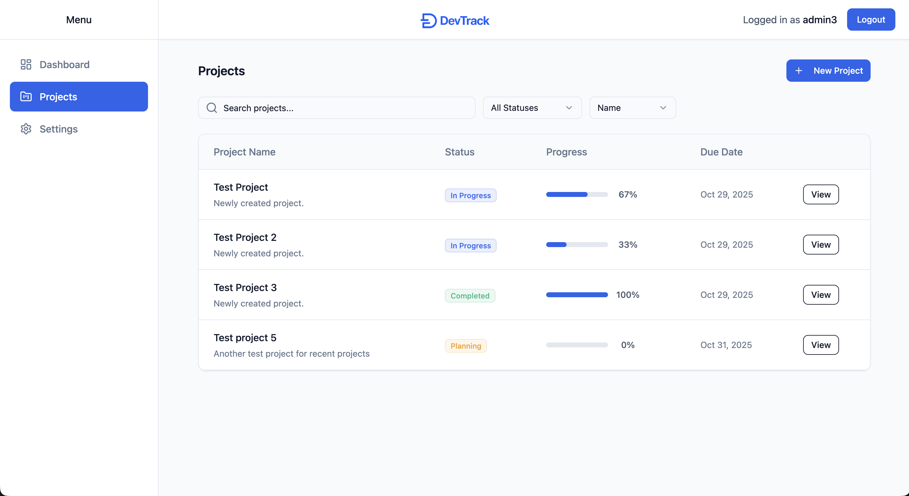
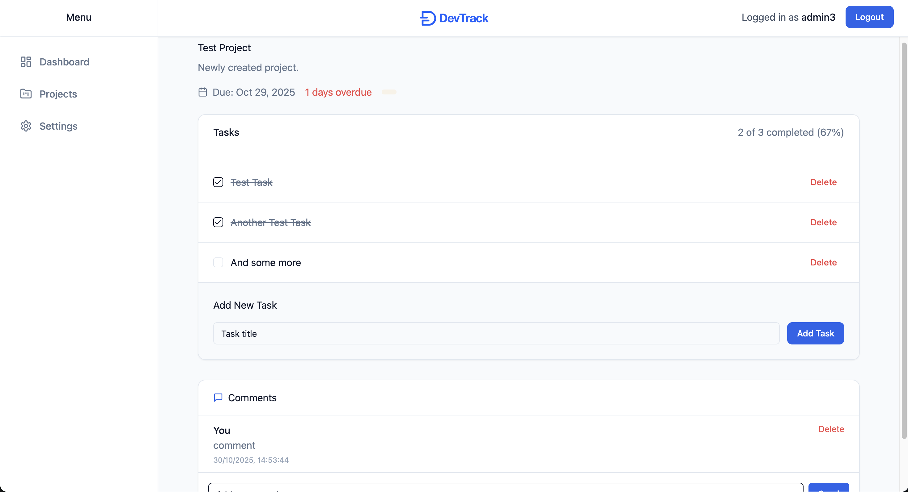
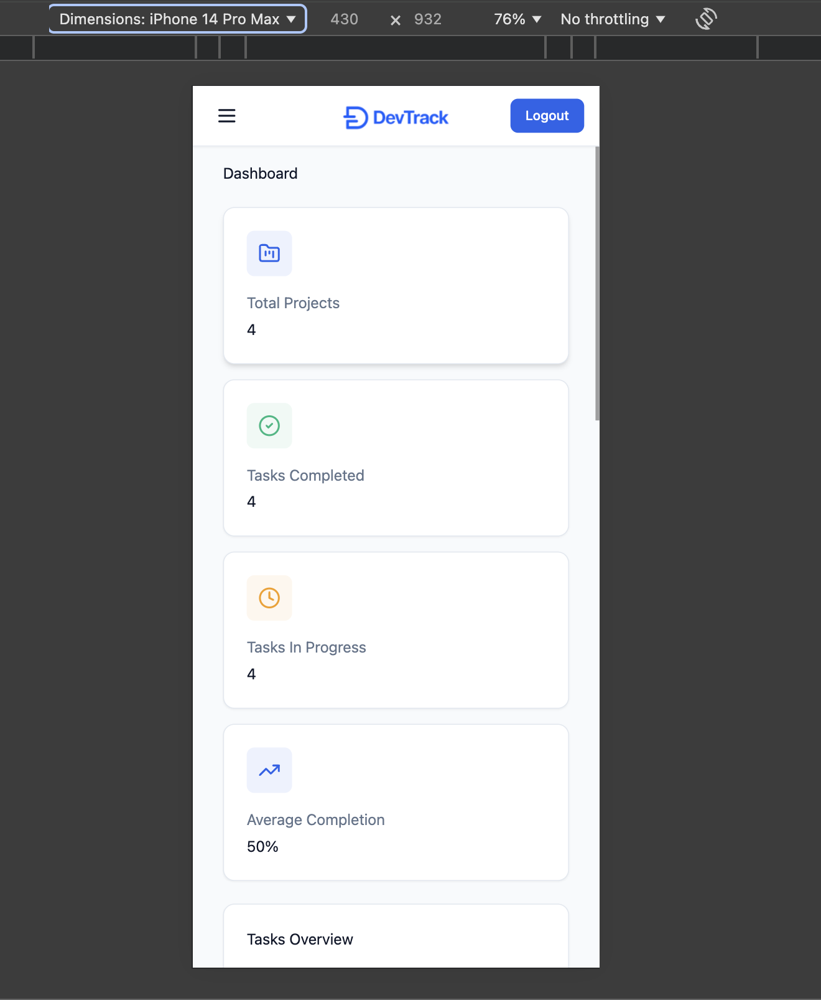

#  DevTrack

A full-stack project management application built with **React**, **Spring Boot**, and **MongoDB**.


---

##  Features
-  JWT-based authentication (Spring Boot)
-  DTO-based backend architecture
-  Real-time dashboard with project and task tracking
-  Activity feed with user attribution
-  MongoDB persistence
-  Responsive React frontend with TailwindCSS

---

## Figma Integration

The frontend was designed and implemented based on a **Figma prototype** to ensure a clean, modern, and consistent UI/UX.

This demonstrates the ability to:
- Interpret design specs and spacing systems
- Convert Figma components to reusable React/Tailwind components
- Maintain pixel-perfect alignment between design and code


##  Tech Stack

| Layer | Technology |
|-------|-------------|
| Frontend | React, TypeScript, TailwindCSS |
| Backend | Spring Boot 3, Java 17 |
| Database | MongoDB |
| Auth | JWT Tokens |
| Build Tools | Maven, Vite |
| Deployment | GitHub Actions CI/CD |

---

##  Project Structure
devtrack-figma-ready/
├── frontend/    → React + Vite + Tailwind
├── backend/     → Spring Boot + MongoDB
└── .github/     → CI/CD pipeline

---

##  Running the App

### Backend
```bash
cd backend/demo
mvn spring-boot:run

### Frontend
cd frontend
npm install
npm run dev

## API Overview
/api/auth/login POST - Authenticate user
/api/auth/register POST - Register a new user
/api/user/me GET - Get current user info
/api/activity GET - List recent activity

#  Preview

### Dashboard


### Login Page


### Projects Page


### Tasks Page


### Mobile Dashboard



Author

Laurentiu Maniliuc

Full-stack Developer
📧 laurentiumaniliuc@gmail.com
💼 https://www.linkedin.com/in/laurentiu-maniliuc-115986221/
